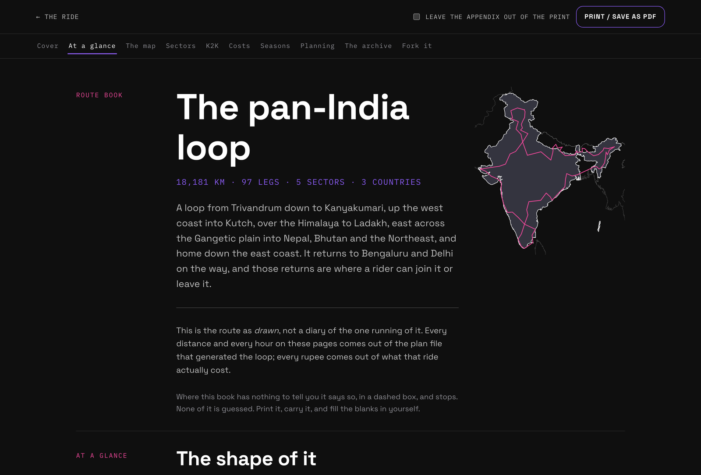
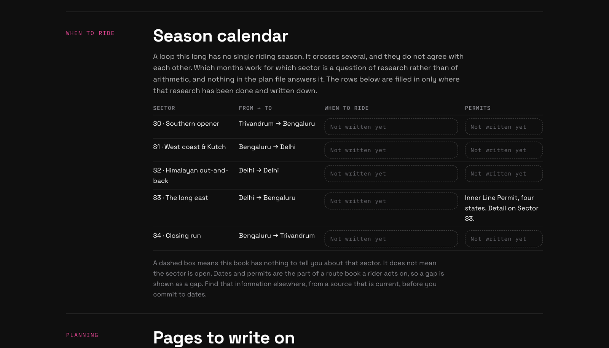
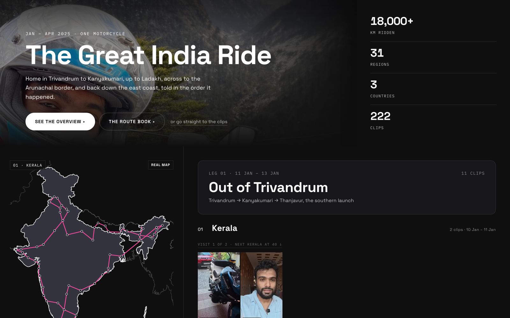

# The Great India Ride

An 18,181 km motorcycle loop of India, Nepal and Bhutan, published as a **route
template you can fork** rather than only as a travelogue.

**[The ride](https://thegreatindiaride.prasanthsasikumar.com/)** ·
**[The route book](https://thegreatindiaride.prasanthsasikumar.com/booklet.html)** ·
**[The data](https://thegreatindiaride.prasanthsasikumar.com/data/template.json)** ·
**[llms.txt](https://thegreatindiaride.prasanthsasikumar.com/llms.txt)**



## What this is

**A route template.** `data/template.json` is the loop as it was drawn: 97 hops, 94
unique waypoints, 18,181.3 km, 411.93 riding hours, five sectors, three countries, each
hop with its coordinates, distance and riding time. This is the file to fork.

**A printable route book.** [`booklet.html`](https://thegreatindiaride.prasanthsasikumar.com/booklet.html)
turns it into something you can carry: sector maps, waypoint tables, a cost projection,
a season and permit calendar, blank planning pages, and a field-research appendix from
the xBhp forum archive. 37 sheets of A4.

**The ride that was actually run.** [`index.html`](https://thegreatindiaride.prasanthsasikumar.com/):
93 nights, 29 regions, every place slept, what was spent, 222 clips.

The template and the record are deliberately **not the same file**. Sections of the
Northeast closed and the weather windows do not overlap, so the loop as planned and the
loop as ridden differ, and both are published.

## Who this is for

Anyone putting together an all-India ride, or a piece of one, from a blank map. What is
here that a blog post is not: real coordinates and distances hop by hop in fetchable
JSON; sector boundaries you can actually cut at; a cost model derived from a real ride;
the gaps left visible; and the build scripts, so you can point them at your own sheet.

| Sector | | From → to | km | Riding hours |
|---|---|---|---|---|
| **S0** | Southern opener | Trivandrum → Bengaluru | 1,130.1 | 22.2 |
| **S1** | West coast & Kutch | Bengaluru → Delhi | 3,643.0 | 74.0 |
| **S2** | Himalayan out-and-back | Delhi → Delhi | 2,742.0 | 61.8 |
| **S3** | The long east | Delhi → Bengaluru | 9,955.2 | 237.4 |
| **S4** | Closing run | Bengaluru → Trivandrum | 711.0 | 16.5 |
| | **The whole loop** | Trivandrum → Trivandrum | **18,181.3** | **411.9** |

The loop returns to Bengaluru and Delhi, and those returns are where a rider joins it or
leaves it. Take one sector, take two, ride it backwards.

## Use the data

Everything under `/data/` is served with CORS enabled. No key, no rate limit.

```bash
curl -s https://thegreatindiaride.prasanthsasikumar.com/data/template.json | jq '.totals'
```

```js
const base = 'https://thegreatindiaride.prasanthsasikumar.com/data/';
const tpl = await (await fetch(base + 'template.json')).json();

// Sector 2, as legs you could hand to any mapping library.
const s = tpl.sectors[2];
const legs = tpl.hops.slice(s.hopFrom, s.hopTo + 1).map(h => ({
  from: h.from, to: h.to, km: h.km, hours: h.hours,
  line: [[h.fromLat, h.fromLon], [h.toLat, h.toLon]],
}));
```

| File | What is in it |
|---|---|
| [`template.json`](https://thegreatindiaride.prasanthsasikumar.com/data/template.json) | The planned loop. Sectors, stages, every hop with coordinates, distance and hours. **Fork this one.** |
| [`template-notes.json`](https://thegreatindiaride.prasanthsasikumar.com/data/template-notes.json) | Hand-written guidance: seasons, permits, points of interest. `TO WRITE` means a declared gap. |
| [`route.json`](https://thegreatindiaride.prasanthsasikumar.com/data/route.json) | The ride as run: stops, nights, hotels, spend. The cost projection derives from this. |
| [`research.json`](https://thegreatindiaride.prasanthsasikumar.com/data/research.json) | The xBhp archive field research, transcribed with its caveats attached. |
| [`k2k.json`](https://thegreatindiaride.prasanthsasikumar.com/data/k2k.json) | Kanyakumari to Kashmir as two lines, one cited and one measured. |
| [`basemap.json`](https://thegreatindiaride.prasanthsasikumar.com/data/basemap.json) | Country outlines, ~32KB, from Natural Earth's India point-of-view file. |
| [`manifest.json`](https://thegreatindiaride.prasanthsasikumar.com/data/manifest.json) | The media library: 222 clips with capture time, region and caption. |

Machines get [`llms.txt`](https://thegreatindiaride.prasanthsasikumar.com/llms.txt), a
sitemap that lists the data files as well as the pages, and a schema.org graph in each
page. All generated: see [Machine-readable front door](docs/route-data.md#machine-readable-front-door).

## What this will not tell you

The most useful thing here may be what it refuses to guess.



- **Riding seasons are unwritten.** Ten guidance notes are empty, and each renders as a
  dashed "Not written yet" box rather than as filler. A route book is *acted on*, so an
  admitted hole beats invented advice. The forum archive could not fill them either:
  its finding is that riders time trips by when they can get leave, not by weather.
- **The cost projection is a floor, not a forecast.** No bike, no shipping, no flights,
  no repairs, and no rest days.
- **Permits change.** The Inner Line Permit note reflects sources read in 2025.
- **Two totals disagree, on purpose.** The sheet's total row says 18,039.2 km; its rows
  sum to 18,181.3 km. The sum is published and the 142.1 km gap is disclosed.

## Build your own

Everything is generated from two Google Sheets exports, neither of which is in this
repo. Swap in your own and the site rebuilds around them.

```bash
node scripts/build-template.cjs "/path/to/Your Trip - Itinerary.csv"   # the planned loop
node scripts/build-route.cjs    "/path/to/Your Trip - Expenses.csv"    # the ride as run
node scripts/build-k2k.cjs                                             # derived: the K2K lines
node scripts/build-seo.cjs                                             # robots, sitemap, llms.txt, JSON-LD
node --test                                                            # 108 tests, no dependencies

python3 -m http.server 8899   # then open http://127.0.0.1:8899/
```

`build-template.cjs` **refuses to run without `data/template-notes.json`**, because a
route book with silent holes where its guidance belongs is worse than no route book.
Write the file even if every entry starts as `TO WRITE`.

Two knobs you will want: `CROSSINGS` in `build-template.cjs` names the cities your loop
returns to, and `SKIP_NIGHTS` / `ORIGIN` in `build-route.cjs` handle rows that are not
on the motorcycle route.

## Layout

```
index.html  booklet.html      the two pages
assets/                       atlas.js, costs.js, images
data/                         everything the pages fetch, CORS open
scripts/                      the generators
docs/                         the long version of this README
media/                        the ride footage, and the credited research plates
test/                         108 tests, Node's own runner
robots.txt  sitemap.xml  llms.txt    generated by scripts/build-seo.cjs
```

## Read more

- **[docs/route-data.md](docs/route-data.md)**: how the template, K2K, the route book
  and the research appendix are built, and what each of them refuses to guess.
- **[docs/the-site.md](docs/the-site.md)**: the front page, the map, and the media
  library behind it.
- **[docs/working-on-this.md](docs/working-on-this.md)**: tests, house style, local dev.



## Licence and credit

The route data, the build scripts and the pages are free to fork and adapt. Two things
are not, and both are marked where they live: the **eight photographs under
`media/research/`** are other riders' work, reproduced from the xBhp forum with their
watermarks intact and a per-image credit; the **ride media under `media/`** is the
author's own.

If you build something on this, a link back is appreciated and not required.
